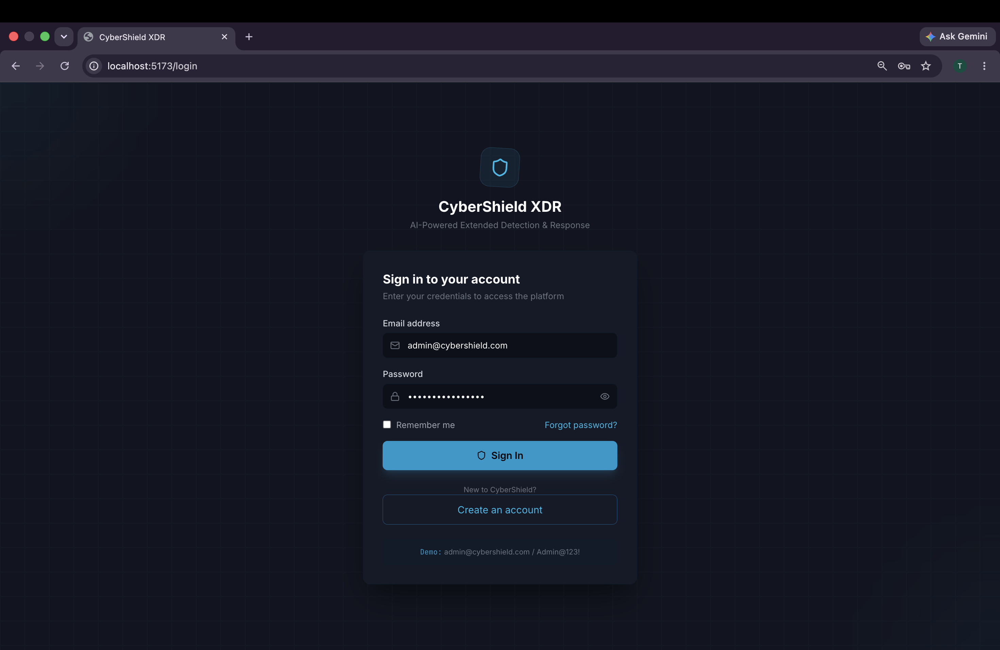
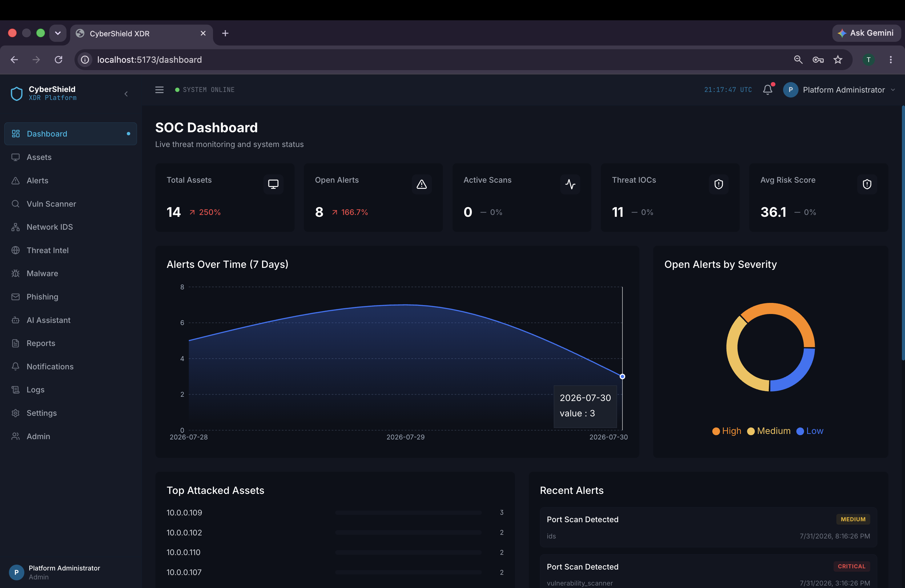
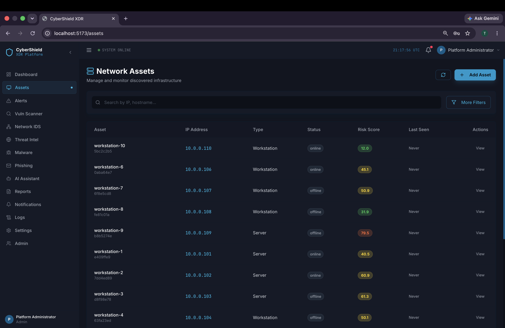
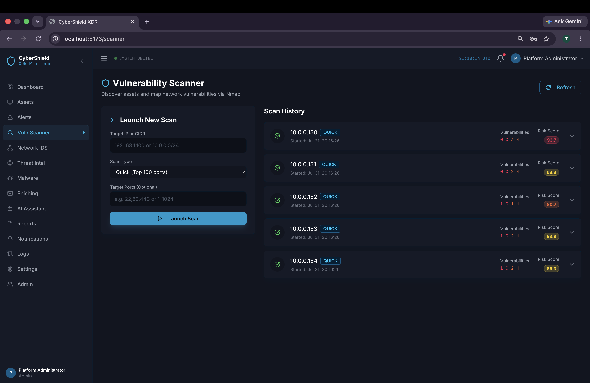
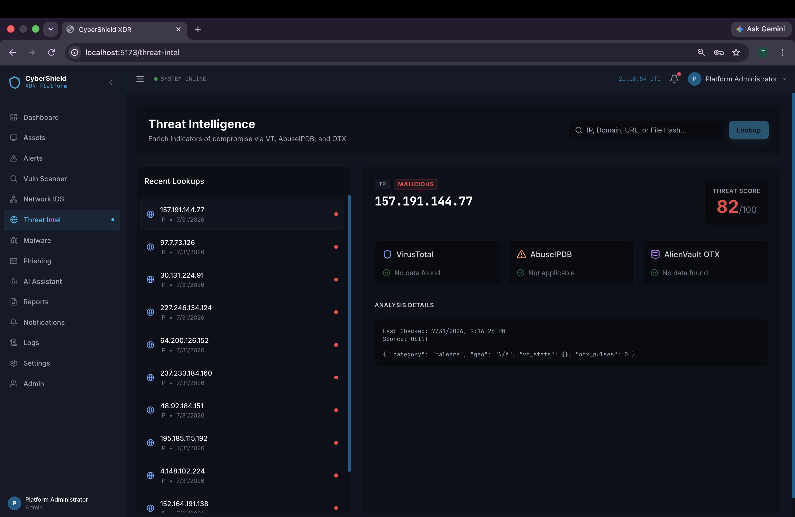
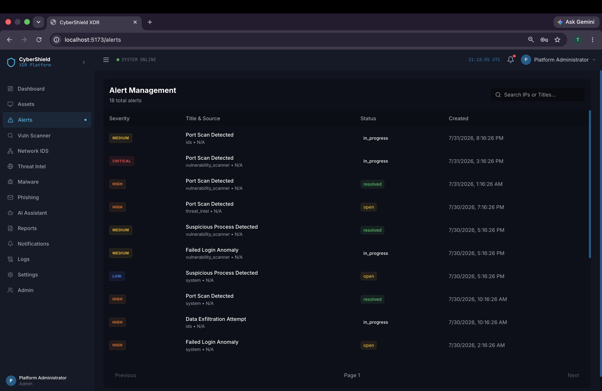
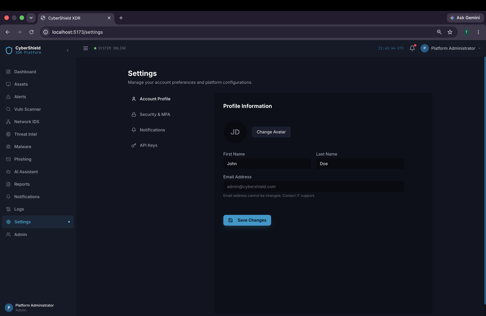
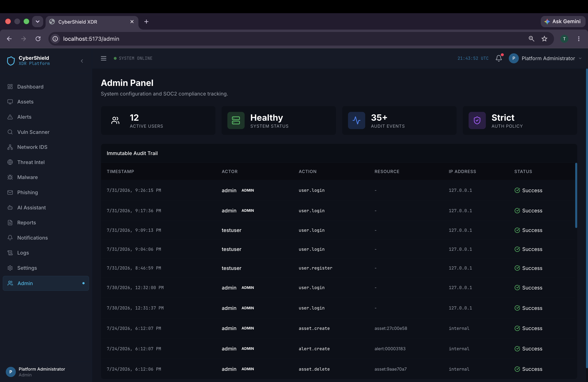

<div align="center">

# 🛡️ CyberShield XDR Platform

### AI-Powered Extended Detection & Response Platform

A modern enterprise-grade cybersecurity platform designed to centralize security monitoring, vulnerability management, threat intelligence, malware analysis, phishing detection, and incident response through a unified dashboard.


</div>

---

# 📌 Overview

CyberShield XDR is a full-stack cybersecurity platform that unifies multiple security operations into a single application.

The platform enables organizations to monitor assets, detect threats, perform vulnerability assessments, analyze malware, investigate phishing attacks, and manage security incidents through an intuitive web interface.

This project demonstrates enterprise-level software architecture using modern backend, frontend, database, and asynchronous processing technologies.

---

# ✨ Features

- Secure JWT Authentication
- Role-Based Access Control (RBAC)
- Security Dashboard
- Asset Inventory Management
- Vulnerability Scanner
- Threat Intelligence Module
- Malware Analysis
- Phishing Detection
- Security Alerts
- Incident Reports
- Admin Panel
- User Management
- Background Task Processing (Celery)
- Redis Integration
- RESTful APIs
- Swagger API Documentation
- Docker Support

---

# 🏗 Architecture

```
                React + TypeScript
                        │
                        │
                 REST API (HTTPS)
                        │
                 FastAPI Backend
                        │
        ┌───────────────┼───────────────┐
        │               │               │
 PostgreSQL         Redis          Celery Worker
        │               │               │
        └───────────────┼───────────────┘
                        │
            Threat Intelligence Engine
```

---

# 🛠 Technology Stack

## Frontend

- React
- TypeScript
- Vite
- Tailwind CSS
- Axios

## Backend

- FastAPI
- Python
- SQLAlchemy
- Alembic
- JWT Authentication
- Pydantic

## Database

- PostgreSQL

## Background Processing

- Celery
- Redis

## DevOps

- Docker
- Docker Compose

---

# 📂 Project Structure

```text
CyberShield-XDR
│
├── backend/
├── frontend/
├── docker/
├── docs/
├── screenshots/
├── uploads/
├── docker-compose.yml
├── README.md
└── LICENSE
```

---

# 🚀 Getting Started

## Clone Repository

```bash
git clone https://github.com/johncybersage/CyberShield-XDR.git
cd CyberShield-XDR
```

## Backend

```bash
cd backend
pip install -r requirements.txt
```

Run

```bash
uvicorn main:app --reload
```

---

## Frontend

```bash
cd frontend
npm install
npm run dev
```

---

# 📖 API Documentation

After starting the backend:

```
http://127.0.0.1:8000/api/docs
```

---

# 📸 Screenshots

## Login Page

<p align="center">

</p>

---

## Dashboard

<p align="center">

</p>

---

## Assets Management

<p align="center">

</p>

---

## Vulnerability Scanner

<p align="center">

</p>

---

## Threat Intelligence

<p align="center">

</p>

---

## Alerts

<p align="center">

</p>

---

## Settings

<p align="center">

</p>

---

## Admin Panel

<p align="center">

</p>

---

# 🔒 Security Highlights

- JWT Authentication
- Secure Password Hashing
- Role-Based Authorization
- API Validation
- Input Sanitization
- SQLAlchemy ORM
- Protected Routes
- Secure REST APIs

---

# 🔮 Future Improvements

- SIEM Integration
- MITRE ATT&CK Mapping
- Threat Hunting
- Multi-Tenant Support
- AI-Based Threat Correlation
- Email Alerting
- Real-Time Monitoring
- Kubernetes Deployment

---

# 📄 License

This project is licensed under the MIT License.

---

👨‍💻 Author
Raj(John) K

Cybersecurity Engineering Student | Full-Stack Developer | AI & Cloud Security Enthusiast

🔗 GitHub: https://github.com/johncybersage
💼 LinkedIn: https://www.linkedin.com/in/raj-k-cybersec/
📧 Email: johnraj.kse@gmail.com
Built with ❤️ for cybersecurity education and research.


-------
<div align="center">

⭐ If you found this project useful, consider giving it a star.

</div>
